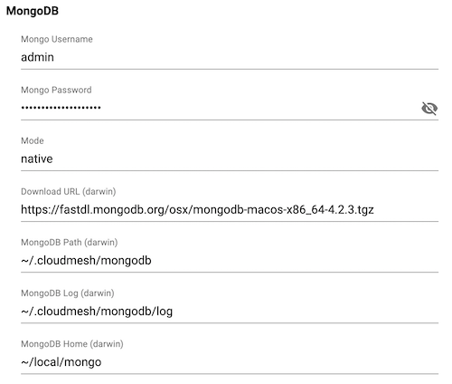

# Cloudmesh Dashboard Features

## Table of Contents

* [Configuration Editing](#configuration-editing)

## Configuration Editing



The Cloudmesh Dashboard offers view / editing of common configuration parameters
from the `~/.cloudmesh/cloudmesh.yaml`.  To access this feature click on `Settings`
in the left sidebar and click the button labeled "Cloudmesh Config".

### Customizing Fields

The fields displayed on this page are defined in the `renderer/fields/[section]-fields.js`
files.  To customize existing fields edit these files according as documented in each
file.  When you are done editing you will need to run `cms viewer deploy` to see your changes.

`cms viewer deploy`

Customizable options at this time include:

* Key path to configuration value
* Label displayed for each value.
* Type of input field to use for the value. ([supported types](https://developer.mozilla.org/en-US/docs/Web/HTML/Element/input))
* Order of fields.

To create a new section of settings you need to do the following.

1. Add a new field configuration file.
2. Add an import for this file in `renderer/pages/settings/cloudmesh.js`
3. Add a new <FormGroup /> component with the imported configuration file.

```jsx
import myConfig from './myconfig-profile'
...
<Form>
  <FormGroup groupTitle="My Config" fieldsConfig={myConfig} />
</Form>
...
```

Don't forget to rund `cms viewer deploy` to compile your changes and install
the modified app.
